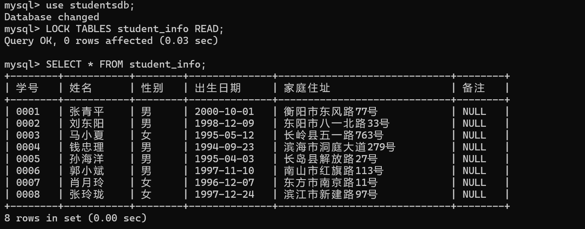
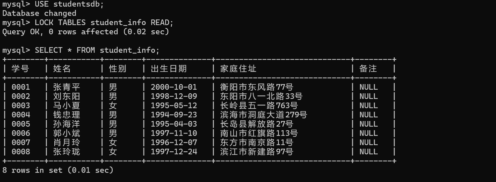
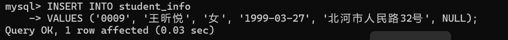
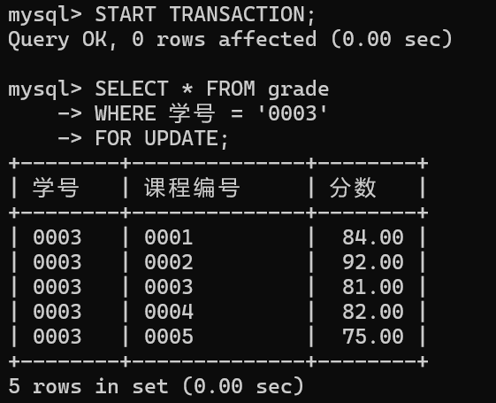
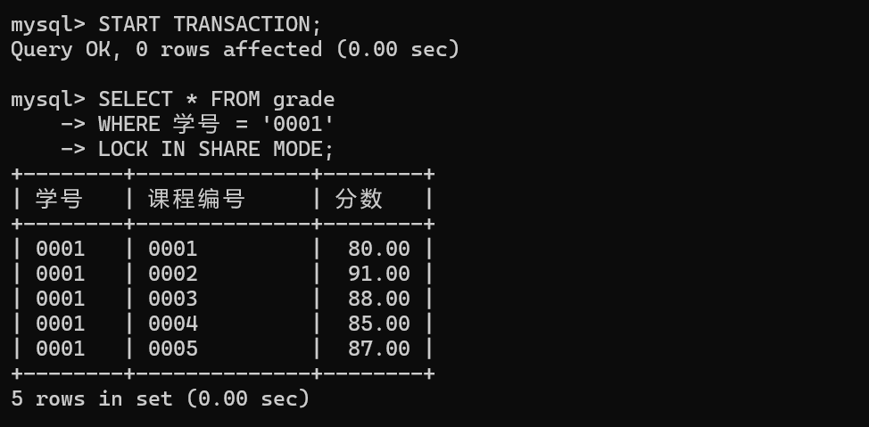
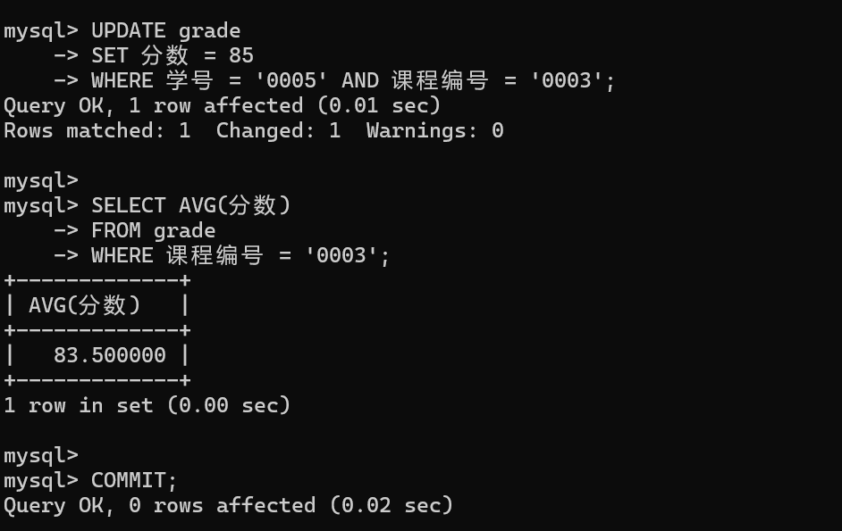
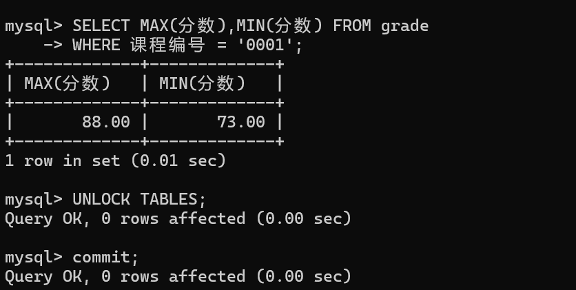
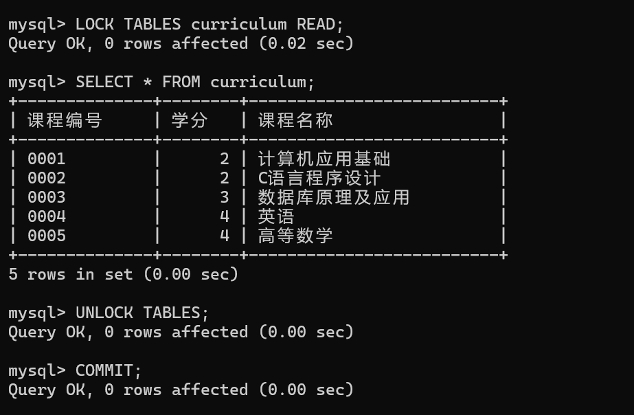

# Mysql的并发控制实验

1. 使⽤studentdb数据库中的student_info表格。
（1）打开MySQL客户机A，对student_info表格施加表级共享锁后查看该表格。
```
USE studentsdb;
LOCK TABLES student_info READ;
SELECT * FROM student_info;
```


（2）在MySQL客户机A上尝试向student_info表格添加⼀条记录，学号0009，姓名王昕悦，性别⼥，出⽣⽇
期1999-03-27，家庭住址北河市⼈⺠路32号，备注为空。能否成功？为什么？
```
INSERT INTO student_info 
VALUES ('0009', '王昕悦', '女', '1999-03-27', '北河市人民路32号', NULL);
```

不能成功，因为表级共享锁阻止了写操作。

（3）打开MySQL客户机B，对student_info表格施加表级共享锁后查看该表格。该操作能否成功？为什么？
```
USE studentsdb;
LOCK TABLES student_info READ;
SELECT * FROM student_info;
```

可以操作成功，多个客户机可以对同一个表添加共享锁  

（4）在MySQL客户机B上解除步骤（3）上的共享锁，并试图在student_info表格上施加表级排它锁。该操作
能否成功？为什么？
```
UNLOCK TABLES;
#获取排它锁
LOCK TABLES student_info WRITE;
```


排他锁一直没有执行成功，因为客户机A已经对student_info表加了共享锁，所以客户机B无法对student_info表加排它锁。
（5）切换⾄客户机A，解除表格上的共享锁。

（6）切换⾄客户机B，在表格上成功上了排它锁后添加步骤（2）中的记录，成功后解除该写锁。




2. 使⽤studentdb数据库。
（1）打开客户机A，开始事务，对grade表格中所有课程编号为0003的记录上⾏级写锁。
```
START TRANSACTION;
SELECT * FROM grade 
WHERE 学号 = '0003' 
FOR UPDATE;
```


（2）打开客户机B，开始事务，尝试对grade表格中学号为0001的记录上⾏级共享锁，能否成功？为什么？
```
START TRANSACTION;
SELECT * FROM grade 
WHERE 学号 = '0001' 
LOCK IN SHARE MODE;
```

成功，因为这是行级锁，可以同时对多行记录上锁。

（3）使⽤客户机B，开始事务，尝试对grade表格上表级共享锁，能否成功？为什么？
```
LOCK TABLES grade READ;
```

不成功，当一个事务对表的部分记录持有写锁时，其他事务不能对整个表施加共享锁

（4）切换⾄客户机A，更新记录使得学号为0005的学⽣，课程编号0003的分数为85；计算此时课程编号为
0003的分数平均分；提交事务。
```
UPDATE grade 
SET 分数 = 85 
WHERE 学号 = '0005' AND 课程编号 = '0003';

SELECT AVG(分数) 
FROM grade 
WHERE 课程编号 = '0003';

COMMIT;
```

事务提交（COMMIT）意味着释放了之前的所有锁

（5）切换⾄客户机B，开启事务，确保grade表格上有了表级共享锁后，通过grade表格查看课程编号为0001
的课程的最⾼分和最低分，再解除对grade表格的共享锁。
```
SELECT MAX(分数),MIN(分数) FROM grade 
WHERE 课程编号 = '0001';

UNLOCK TABLES;
COMMIT;
```



（6）使⽤客户机B，对curriculum表格施加表级共享锁，并查看该表格，之后解除共享锁，并提交事务。
```
LOCK TABLES curriculum READ;
SELECT * FROM curriculum;
UNLOCK TABLES;
COMMIT;
```


（7）在上述（1）-（6）的步骤中，遵守的是⼏级封锁协议？它能够防⽌哪些并发问题？这些步骤是否遵守两
段封锁协议？

封锁级别：

这些步骤遵守的是两阶段锁协议（Two-Phase Locking, 2PL）。

具体特征：

第一阶段（扩展阶段）：只允许获取锁，不允许释放锁  
第二阶段（收缩阶段）：只允许释放锁，不允许获取新锁

防止的并发问题：

防止脏读（读取未提交的数据）  
防止不可重复读（同一事务中多次读取数据结果不同）  
防止幻读（事务执行过程中，另一事务插入了影响结果的新记录）  

两段锁协议的特点：

事务中的所有加锁操作必须在解锁操作之前完成  
确保了事务的隔离性   
可以防止大多数并发事务带来的数据一致性问题  

是否严格遵守两段锁协议：

是的，每个事务都遵守了两段锁协议，先进行锁的获取（扩展阶段），后进行锁的释放（收缩阶段），没有出现在释放锁后又获取新锁的情况

通过这种锁的使用方式，可以有效地控制并发事务，保证数据的一致性和隔离性。

