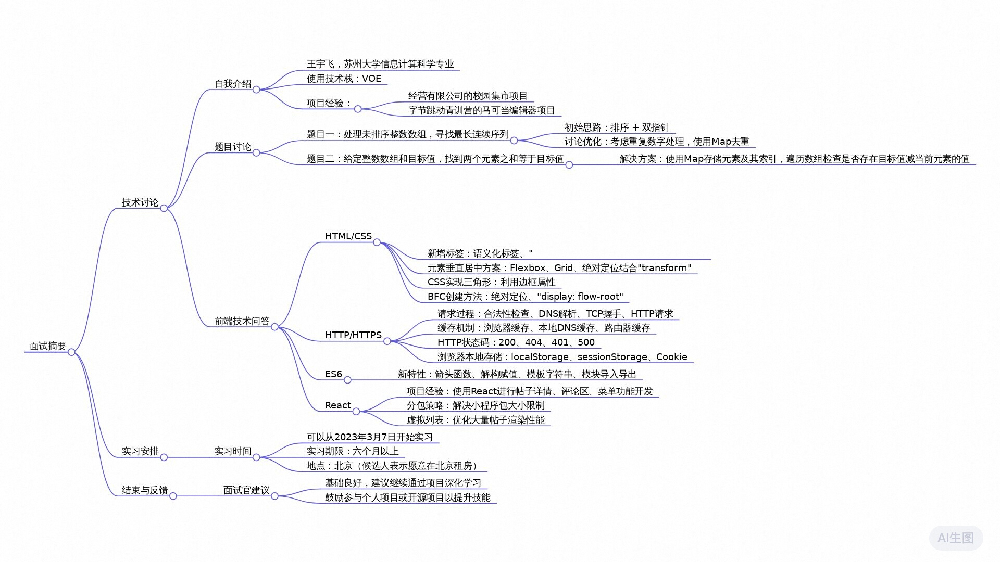

# 前端百度面经

百度面试_原文
2025年02月25日 15:55
发言人1   00:01
可以。可以了。

发言人2   00:07
首先你先做个简单的自我介绍。

发言人1   00:13
OK，我叫王宇飞，来自苏州大学信息计算科学专业。然后我目前使用的技术站是VOE。然后目前有两个项目，一个是在经营有限公司的一个校园集市的项目。然后另一个是在字节跳动青训营的一个马可当编辑器的项目。

发言人2   00:37
了解。然后首先我们先做题目，然后我在这个电脑考核发布。

发言人1   00:48
1OK。

发言人2   00:59
可以看到吗？

发言人1   01:00
可以。

发言人2   01:01
你。先看一下题目，然后什么不懂的就可以问。

发言人2   01:44
对，就你做之前可以跟我说下你然后再写。

发言人1   01:55
好。

发言人1   02:05
他他他这个数数数组里面这个数字的范围有吗？

发言人2   02:15
你可以认为它是一个有限的。

发言人1   02:20
有限的范围是什么？就是数组，就数组里面这个数字它的范围有。

发言人2   02:30
数字的范围。假设就是它这个数组的长度是N那么它数字的最大也就是。

发言人1   02:52
数组的长度是N数字最大就是N那那这个地方有这个数组的长度是6，这个真的是啊。

发言人2   03:01
对，你可以理解为它它不会是一个无穷大的，就最大值是无穷大的一个。

发言人1   03:09
数字OK对。

发言人1   03:41
首先我要考虑先用什么数据结构来存储这个数字，然后可以体现出它的连续的关系，然后。

发言人1   04:30
我也没什么思路。

发言人2   04:34
比如说首先它是一个未排序的整数的数据。

发言人1   04:39
对吧？如果可以直接用API是吗？

发言人2   04:44
对，如果说它是一个有序的数组原因我现在并没有限制时间复杂度，什么空间复杂度之间对吧？就假设现在就是你有人在想，这是一个比较暴力的一个企业。

发言人1   05:05
放学妹。

发言人2   05:14
没关系，你可以顺着这个思路想想。

发言人1   05:18
有没有什么写对。

发言人2   05:21
然后然后再开始。

发言人1   05:34
先把它排序，排序完之后再。

发言人1   05:46
在设置在。再用一个数组存储我们最大连续的值，然后遍历这个数组，我们如辩论这个数组。我们应该用两个数组。一个数组是存储我们目前为止不便利，到目前为止我们所有存储的连续的最大序列。然后另一个数组就是用来。

发言人1   06:31
另一个数据就是存储器，这是排名第二的。这个是也一个一个是一个是存储一个最长的一个是存储第二层的。

发言人2   06:47
一个他的一个是。

发言人1   06:50
我想一下。

发言人1   07:09
我我我没想出应该用是用什么数据结构来存。

发言人2   07:14
对他其实最后输出的最后的结果是一个数字是吧？其实它就是一个基本类型，不需要存储你最长序列的这个数值。然后嗯对比如说这个已经是一个连续的，而且是排序的一个数字，那么是不是就可以通过双指针？

发言人1   07:41
比如说我对左边的指针是啊对。

发言人2   07:45
这个连续序列的最左侧，然后右侧去找到它最长的那个序列的最右边的一个值。然后通过遍历整个数组找到最长的一个图形，这个是基本的写法，就是可以想到暴力的写法。对，然后其实我这边还有另一个思路，就是首先因为你排序之后，我可以看到它势必要里面它有两个点对吧？就是我并没有限制这个数字的，这个数字它是一个没有重复的数字，也就是说这个数字里面可能会有一些数字是重复的。也就是说你即使进行排序之后也需要去重。如果不去重的话，也通过那个双指针需要去跳过这个重复的数字。然后就是有没有一种数据结构，它能够就会删除这个重复的数据，比如说map之类的。你看你这边有其他思路吗？

发言人1   08:57
面部。

发言人1   09:10
重复的。

发言人1   09:20
刚刚那个双子针他为什么是爆裂解放？我感觉已经我感觉效率已经还可以了。

发言人2   09:28
还行，但是主要就是他有第一步那个排序的过程，使得他那个长度其实不是特别好。对，这个双指针它的前提是在排序的整数数组里面可以搞。行，那我可以换个题目。

发言人1   09:45
谢谢。

发言人2   09:49
这个就比较简单。

发言人2   10:07
能看到吧。

发言人2   10:21
就给定一个整数数组，然后一个目标值到底找到一个通过这个数组两个元素组成的。

发言人1   10:35
就是首先设定一个map先然后呃然后遍历这个数组。当我们遍历这个数组，首先先检查这个map里面有没有这个先检查这个map里面有没有这个数字对应的记录。有就是说比如说变异到2的话，我们就查这个对应的二属性它有没有记录。然后如果说如如果说没有的话，我们就将这个。我们就将。

发言人2   11:22
这个。

发言人1   11:23
二存储进去。然后。对，这样哎也不是。首首先首先我们先检查这个7 9减9减2。比如说便利到第一个数字，我们先检查9减2这个数字在这个map里面存不存在。然后如果说存在的话，我们就直接返回这个返回我们map对应的这个77对应属性的这个值。还有还有当前便利的这个是这个数字它在数组中的位置，它的index，然后把它存存进去就是一个值。然后如果说不存在的话不存在的话，我们就将当前的这个数组的这个值，还有它的index，把它存到这个map里面去。

发言人2   12:39
行。那你试着实现一下。

发言人1   13:59
他他他是只要找到一个等于9的就直接返回是吗？如果说还有其他的，还有只需要。

发言人2   14:07
找到一个就行OK。

发言人2   14:53
理解这个疑问很漂亮。

发言人2   15:00
对，这两天就是补偿。

发言人2   15:14
对，前面那两个都是吧。小时间节点。

发言人2   16:42
写完了是吗？很大的人应该是没啥问题。行，那我下面我就问一下你前端的相关的一些问题OK。

发言人2   16:59
然后首先就问一些比较基础的TML和CSS那些相关的问题。就是我看你那个简历没有写HTM，你对HDM有一些新增的标签有什么了解？

发言人1   17:19
HML首先它新增了语义化，然后还有video，29还有。就这些。

发言人2   17:39
然后。下一个问题就是如果想要实现一个元素，它在它的负元素里面去垂直居中对齐，你这边有哪些方案？然后在你项目中最主要用。

发言人1   17:58
的是什追逐机中最常用的是使用flag秘诀设置那个呃首先设置一个主轴，主轴如果说我们可以设置这个a line items，是a line item是他在交叉轴的上面的方向，然后那个just by content是这个主轴方面方向最终情况。然后我们还可以通过设置设设设设设设置这个mag top为50%，然后我们来给left 50%，然后再设置它的它八点为-50%，然后就可以将它移到中间。

发言人2   18:51
还有其他出路吗？

发言人1   18:53
然后还有使用那个change transparent，然后还有使用这个。0PX auto。

发言人2   19:11
OK. 然后下一个问题就是你在项目中有遇到过实现三角形的场景。比如说这个对话框的那个气泡的那个箭头，如果要你用CSS的方式去实现一个三角形，你这边有什么事？

发言人1   19:36
三角形就是我们的那个盒子模型。如果说我们设置它的border border它的宽度超过这个padding的时候，然后它事实上就是一个由由三个由四个三角形组成一个正方形，然后我们就可以好设置。比如说如果说是一个向上箭头的话，我们就可以设置上面的三角形，左边的三角形、右边三角形，我们把它设置为透明，然后这剩下来的就是一个三交了。

发言人2   20:10
行，还有一个问题就是你刚刚提到的这个盒子模型，但是你对于构建一个这样的一个BFC的话，你有什么方法？

发言人1   20:32
构建一个VFC，我们可以设置它的这个。设置为绝对定位，然后还有。还有其他分析的。

发言人2   20:51
这个就是我们通过创建这样一个盒子模型，主要是避免哪些问题？

发言人1   20:58
主要就是B就是创建BFC是吗？创建BFC它是就是为了避免其他元素干扰到我们所想要的那个盒子里面的布局，然后再把它独立出来。

发言人2   21:22
就是你有遇到过，比如说和AB两个元素是相接的，然后下面上面设置一个八点，不可能20PS然后下面是一个market top是一个十PS然后发现下面那个被吃掉这种场景。

发言人1   21:39
对，高速塌陷是吧？

发言人2   21:44
对，就是一个。

发言人1   21:46
对。

发言人2   21:46
也可以解决这个问题。对，好，然后下面问一问这个HTPB相关的问题，问一个比较基础，就是当我对浏览器我输入一个UIL，然后到最终这个页面去呈现这个界定的哪一些过程。

发言人1   22:08
首先。

发言人2   22:09
大概。

发言人1   22:14
首先它会判断我们输入的这个UIL是否合法。然后如果合法的话，他就会进行这个DNS解析。DNS解析然后得到域名，然后通过再获取它的mac地址，然后在发送这个AHTP请求，进行AHCTPAS握手，再进行GCP握手，然后建议连接在在渲染页面。这是大概的。

发言人2   22:57
然后就想问一下，就是在构建这个。连接过程中就是有一些缓存的机制，这个你了解。

发言人1   23:12
比如说好我们的DDNS域域名解析的时候，它会先检查我们的这个本地域名解析器，DNS解析器。然后如果说本地先检查这个浏览器的缓存，你们有没有，然后再检查我们的整个电脑的电缓存里面有没有，然后再检查这个路由那有没有，然后再一逐级往上传。

发言人2   23:46
然后这个HTP的状态码一些都聊掉。列举几个你这边。

发言人1   23:54
比如说。

发言人2   23:55
项目中遇到的。

发言人1   23:57
比如说返回200说明这个请求成功，返回404说明没有找到，返回那个444401说明没有授权，然后返回这个500说明服务器发生错误。

发言人2   24:18
请浏览器的本地存储，你这边有用过吗？

发言人1   24:26
本地存储可以使用log story，set story及cookie。然后lock storage的话，它是长期保持保持存在这个浏览器里面的。然后a sense story的话，它是当我们关闭浏览器的话，它就会被清除。

发言人2   24:53
然后cookie . 

发言人1   24:57
cookie cookie它是它是一个一段序列号。然后把它发送给后端的话，就可以获取这张图可以对应的这个资源。

发言人2   25:15
行，然后我看你简历也写到，对于这个ES6有一定的了解。你可以列举几个你在项目中用的ES6相关一起发，然后闭眼说出他的有什么有什么作用之类。这个也是。

发言人1   25:39
比如说我们这个ES6，它新增了that快捷作用域，然后它相当于原来的那个味儿的话，它防止变相提升。然后。

发言人2   25:55
其他。

发言人1   25:57
的还有这个叫什么？那个叫什么函数来着？

发言人2   26:08
比如说数组的一些便利的一些方法，用的比较常见的。

发言人1   26:13
对，是数组可以说一下数组的话可以使用这个233个点，然后把它给把这个把数组的内容把它给展开，然后还可以进行这个数组进行赋值。我们在进行两个变量的值交换的时候，我们可以使用一个数组来进行。

发言人2   26:37
如果我想查找一个元素在里面，有哪些方式？

发言人1   26:46
查的这个元素是查到他的位置还是他的。

发言人2   26:50
对返回他的它的index。

发言人1   27:02
就in this of。

发言人2   27:07
换了一个。

发言人1   27:14
这个我不太记得我。

发言人2   27:16
我一般。

发言人1   27:17
都是说这个SDN。

发言人2   27:26
这个common GS和EM model的区别这边了解。

发言人1   27:33
空coin JS是使用那个request行导入导出。然后然后先等一下，我把这个电话关掉。和我们的这个EES6。

发言人1   27:51
ES6的话是使用export import进行导入导出。然后common GS是早期还没有规范的时候，这个社那个社区就自发发起的这么一个规范标准。然后后面ES6是啊比较ESM，ESM是后面那个规范化的。

发言人2   28:21
然后我看你的项目都是运用，然后其实咱们现在就是我团队里面目前用的都是react，这个对你会有。

发言人1   28:32
困扰没有？我可以，我这个如果说学用的话，学个VIP很快。

发言人2   28:44
行，然后这边其实没有太大的问题，你可以简单的就简述一下你的项目。我看里面有提到你做了什么分包，还有什么虚拟列表，这个你可以简单的阐述一下，就是余额实现，然后有遇到过什么比较困难的问题，还是怎么解决像。

发言人1   29:08
我们这个是欧欧女校园，那是个可以进行发帖，可以进行二手交易的这么一个小程序。然后我主要负责的是你们这个帖子详情。当我们点开帖子列表，我们可以看到这个帖子，然后还有他的评论区，还有各种菜单功能，然后他给举报删除。然后还有点击个人主页的这个个他的所有历史发表的这个帖子记录的列表的渲染。

发言人1   29:43
我主要是负责这几块，然后这个分包的话我们就主要是在这个pay点Jason里面设置一个so package级的字段。那个入root就代表是那个主播，那个配置对应的就是分包。它主要是我们小程序，它是有那个包的大小的限制的，然后他的那个限制好像是。200MB多少？对，然后通过分包的方式的话，然后就可以房子。因为这个小程序的包大小限制，然后。然后导致这个项目就没办法打包，而是去列表的话，就是我们可以它是当我们需要渲染大量的这个铁的时候，把我们所有帖子全都渲染出来，它的这个性能损耗是比较大的。然后我们就可以通过虚拟列表，只只只只只显示一部分的这个字段，然后设置它的我们所显示的这个index的这个范围。

发言人2   31:15
这个具体是怎么实现的呢？

发言人1   31:22
具体。

发言人1   31:28
具体我不太记得。

发言人2   31:32
比如说是通过什么enjoy talk，等于或者说等于几平的高度之内的，然后跟index就是怎么做的这个联动，是这样的一个思路。

发言人1   31:51
一一一开始本来是想做把它进行分页进行交代的。然后后后面然后后后然后后面他们感觉每次都要点击这个交货不太好，对，交互不太好，然后就。

发言人2   32:13
OK行，那我这边没什么问题。然后最后就想问问你这边的能够实习的时间。因为我看你是在苏打，我们这个部门现在是在北京，就对于你来说会有一点。

发言人1   32:29
没关系，我这个租住在那租房子。

发言人2   32:35
那你这边的实习时间可以。

发言人1   32:39
可可以是你现在。

发言人2   32:41
是22年9月，你现在是大三是吧？大四大三大三上大三下，你现在就相当于基本就没课了。就是你所以你这边能够。

发言人1   33:00
实行2 3月33月7号可以到岗，然后可以学习。

发言人2   33:09
六个月以上。OK行，你这边还对我有什么问题吗？

发言人1   33:17
就是刚刚一轮面试下，你觉得对我这个学习的方向有什么建议吗？

发言人2   33:28
挺好的，基础挺好的，然后可以做一些热爱项目学习一下。

发言人1   33:35
OK. 

发言人2   33:35
是因为我要你跟岳哥是不能一个O. 

发言人1   33:41
KOK好的，谢谢。

发言人2   33:46
咱们今天面试就到这。

发言人1   33:48
OK. 

发言人2   33:49
OK好，拜拜。

发言人1   33:52
再见。
