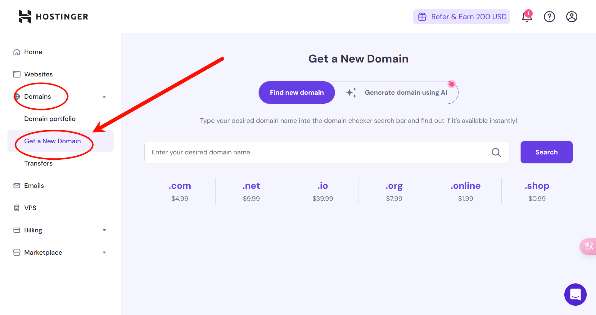
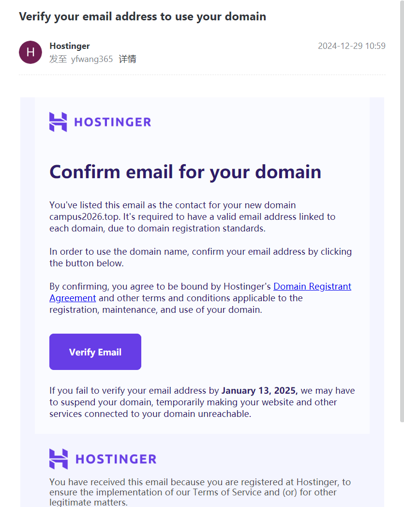
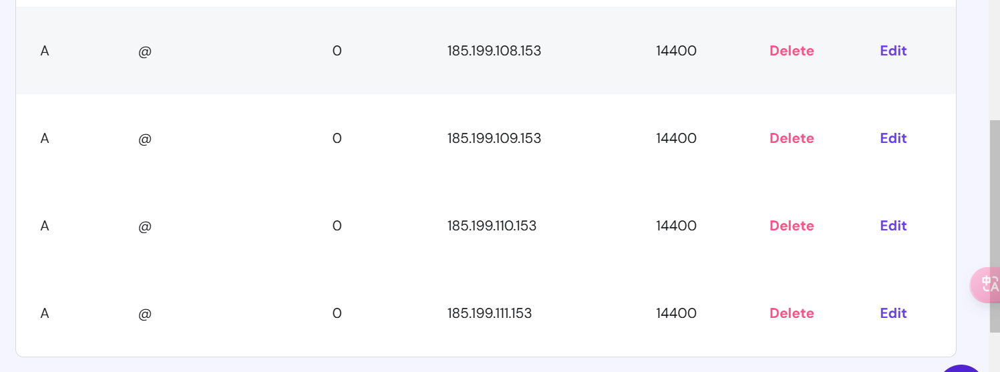
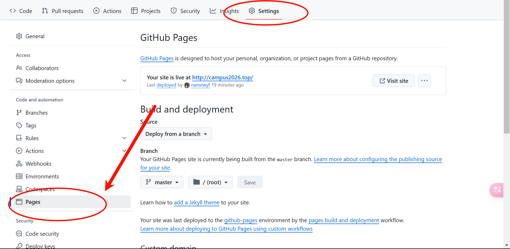
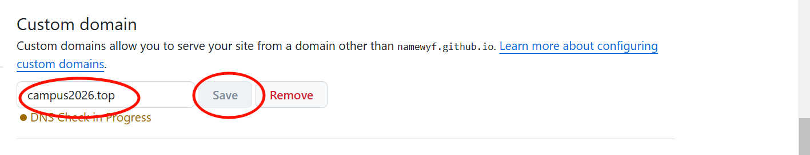

# 如何注册和使用域名

## 购买域名
这里我推荐使用<https://hpanel.hostinger.com/>

打开网站后注册，点击Domains->get a new domain搜索你想要的域名

点击购买，这里使用支付宝方式付款

## 邮件确认

这一步很重要，千万不要漏了，购买完毕后你的注册邮箱会收到一封确认邮件，你需要在14天内点击确认，否则就会过期

## 验证 GitHub Pages 的自定义域

这里可以查看官方文档进行，验证自定义域名：
<https://docs.github.com/zh/pages/configuring-a-custom-domain-for-your-github-pages-site/verifying-your-custom-domain-for-github-pages>

## 添加记录，指向github地址
如图，我怎么做的，你就怎么做

## 在仓库的github page添加自定义域名

填写域名后，点击save
