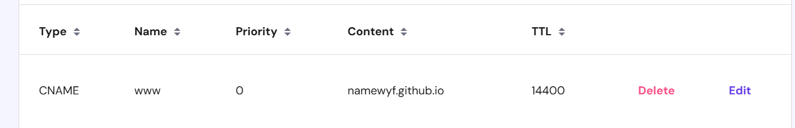

# 如何注册和使用域名

## 购买域名
这里我推荐使用<https://hpanel.hostinger.com/>

打开网站后注册，点击Domains->get a new domain搜索你想要的域名

点击购买，这里使用支付宝方式付款

## 邮件确认

这一步很重要，千万不要漏了，购买完毕后你的注册邮箱会收到一封确认邮件，你需要在14天内点击确认，否则就会过期

## 验证 GitHub Pages 的自定义域

这里可以查看官方文档进行，验证自定义域名：
<https://docs.github.com/zh/pages/configuring-a-custom-domain-for-your-github-pages-site/verifying-your-custom-domain-for-github-pages>

## 添加记录，指向github地址
如图，我怎么做的，你就怎么做

## 在仓库的github page添加自定义域名

填写域名后，点击save

## 如果出现TLS证书一直颁发不下来怎么办
TLS 证书未能通过，可能是由于以下原因：   
DNS 配置错误：确保您的域名 DNS 记录正确地指向 GitHub Pages。具体来说，您的域名应该有一个 CNAME 记录指向 username.github.io 或者一个 A 记录指向 GitHub Pages 的 IP 地址。
>注意是username.github.io而不是username.github.io/project
